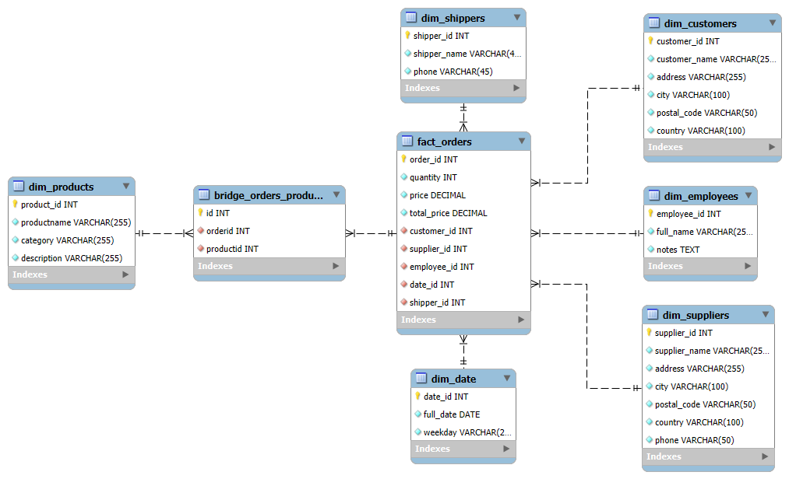

# **ETL proces datasetu NorthWind**
Účelom tohto úložiska je implementovať proces ETL v softvéri Snowflake, ktorý sa zameriava na analýzu údajov zo súboru údajov NorthWind. Súčasťou projektu je skúmanie, transformácia a načítanie údajov týkajúcich sa zákazníkov, dodávateľov, zamestnancov, lokalít a iných dôležitých osôb do viacrozmerného modelu typu hviezda. Dátový model pomáha pri rozhodovaní a poskytuje užitočné poznatky pre ďalšie spracovanie údajov. Poskytuje tiež efektívnu analýzu a vizualizáciu kľúčových ukazovateľov.

---
## **1. Úvod a popis zdrojových dát**
Cieľom projektu je implementovať procesy ETL v prostredí Snowflake na spracovanie a analýzu vybraných súborov údajov. Cieľom projektu je vytvoriť  multi-dimenzionálny model typu hviezda na vizualizáciu a analýzu dôležitých ukazovateľov. Hlavným cieľom je transformácia nespracovaných údajov z rôznych zdrojov do formátu vhodného na analýzu a prezentácia výsledkov s cieľom poskytnúť cenné analytické poznatky a podporu pri rozhodovaní. Odkaz na DB najdete [tu](https://github.com/microsoft/sql-server-samples/tree/master/samples/databases).

### **Zdrojove data:**
- `categories.csv`: Obsahuje informácie o kategóriách produktov.
- `customers.csv`: Údaje o zákazníkoch.
- `employees.csv`: Informácie o zamestnancoch.
- `orderdetails.csv`: Údaje o objednávke.
- `orders.csv`: Podrobnosti o objednávke.
- `products.csv`: Informácie o produkte.
- `shippers.csv`: Informácie o dopravcovi.
- `suppliers.csv`: Údaje o dodávateľovi.

Úlohou procesu ETL je pripraviť údaje, transformovať a sprístupniť ich na ďalšie vytváranie tabuliek demencie a tabulky faktov.

---
### **1.1 Dátová architektúra**

ERD diagram NorthWind:

|  |
|:-:|
|*Obrazok 1: Entitno-relacna schema MovieLens*|

## 2. **Dimenzionalny model**

Je uvedený model hviezdicovej schémy, v ktorej `fact_orders` je hlavnou tabuľkou faktov a sú zahrnuté ďalšie dimenzie:
- **`dim_products`**: Obsahuje informácie o produktoch (ID produktu, názov produktu, kategória, opis produktu).
- **`dim_customers`**: Ukladá informácie o zákazníkovi (obsahuje ID zákazníka, meno, odkaz na miesto a kontaktné údaje.).
- **`dim_suppliers`**: Obsahuje informácie o predajcovi (ID predajcu, názov predajcu a kontaktné údaje.).
- **`dim_employees`**: Uložené údaje o zamestnancoch (identifikátor zamestnanca, jeho celé meno a popis).
- **`dim_date`**: Tabuľka časových údajov (dátumy a ich atribúty: rok, mesiac, deň spoločne a deň v týždni).
- **`dim_shippers`**: "Obsahuje informácie o prepravných spoločnostiach (ID spoločnosti, nazov, telefonne číslo)."

Na správne mapovanie relácie N:M medzi objednávkami a produktmi sa použila prepojovacia tabuľka `bridge_orders_products`.

Štruktúra multi-dimenzionálneho modelu typu hviezda je znázornená nižšie

|  |
|:-:|
|*Obrazok 2: Star schema NorthWind*|

## **3. ETL proces v Snowflake**

ETL proces zahŕňal tri hlavné fázy: `extrakciu` (Extract), `transformáciu`(Transform) a `nahratie` (Load). Tento proces bol realizovaný v prostredí Snowflake s cieľom spracovať zdrojové dáta zo staging vrstvy a pripraviť ich na využitie vo viacdimenzionálnom modeli, ktorý je optimalizovaný pre analýzu a vizualizáciu.

---
### **3.1 Extract (Extrahovanie dát)**

Pomocou tohto príkazu vytvoríme novy `Stage` na dočasné uloženie údajov v systéme Snowflake a nahráme tam naše `.csv` súbory.

```sql
CREATE OR REPLACE STAGE igilchik_stage FILE_FORMAT = (TYPE = 'CSV' FIELD_OPTIONALLY_ENCLOSED_BY = '"');
```

Potom vytvoríme nové `Staging` tabuľky, po ktorých prenesieme údaje zo súborov `.csv` do novovytvorených tabuliek. Podobný príkaz bol použitý pre každú tabuľku:

1. **Vytvorenie**

```sql
CREATE OR REPLACE TABLE customers_staging (
    id INT,
    customername STRING,
    contactname STRING,
    address STRING,
    city STRING,
    postalCode STRING,
    country STRING
);
```

2. **Importovanie dat**

```sql
COPY INTO customers_staging
FROM @NORTHWIND_IGILCHIK.PUBLIC.IGILCHIK_STAGE/customers.csv
FILE_FORMAT = (TYPE = 'CSV' FIELD_OPTIONALLY_ENCLOSED_BY = '"' SKIP_HEADER = 1);
```

3. **Overenie spravnosti prikazu:**

```sql
SELECT * FROM customers_staging;
```

### 3.2 **Transformácia dát**

V tejto fáze sa údaje vyčistili, preložili a obohatili. Hlavným cieľom bolo vytvoriť tabuľky faktov a demencie na jednoduché a efektívne analýzy.

#### **3.2.1 Dimenzionálne tabuľky**

1. Tabuľka `dim_products` bola vytvorená spojením tabuľky `products_staging` s tabuľkou `categories_staging`, čím sa pridali informácie o kategóriách k produktom. Tabuľka `dim_products` obsahuje informácie o produktoch, ako je ich názov, kategória a popis. <br>
**Typ dimenzie: SCD1 (Slowly Changing Dimensions - Overwrite Old Value)** <br>
Informácie o produktoch sa aktualizujú bez uloženia histórie zmien.

```sql
CREATE OR REPLACE TABLE dim_products (
    product_id INT,
    productname VARCHAR(255),
    category VARCHAR(255),
    description VARCHAR(255)
);
```
```sql
INSERT INTO dim_products (product_id, productname, category, description)
SELECT 
    p.ProductID,
    p.ProductName,
    c.CategoryName, 
    c.Description AS CategoryDescription
FROM products_staging p
JOIN categories_staging c
ON p.CategoryID = c.CategoryID;
```

2. Tabuľka `dim_customers`s bola vytvorená extrakciou údajov z tabuľky `customers_staging`. Obsahuje základné informácie o zákazníkoch, ako je ich identifikátor, meno, adresa, mesto, poštové smerovacie číslo a krajina. <br>
**Typ dimenzie: SCD1 (Slowly Changing Dimensions - Overwrite Old Value)** <br>
Informácie o zákazníkoch sa aktualizujú bez uloženia histórie zmien.

```sql
CREATE OR REPLACE TABLE dim_customers (
    customer_id INT,
    customer_name VARCHAR(255),
    address VARCHAR(255),
    city VARCHAR(100),
    postal_code VARCHAR(50),
    country VARCHAR(100)
);
```
```sql
INSERT INTO dim_customers (customer_id, customer_name, address, city, postal_code, country)
SELECT 
    CustomerID AS customer_id, 
    CustomerName AS customer_name,
    Address AS address,
    City AS city,
    PostalCode AS postal_code,
    Country AS country
FROM customers_staging;
```

3. Tabuľka `dim_suppliers` bola vytvorená extrakciou údajov z tabuľky `suppliers_staging`. Obsahuje základné informácie o dodávateľoch, vrátane ich identifikátora, mena, adresy, mesta, poštového smerovacieho čísla, krajiny a telefónneho čísla.<br>
**Typ dimenzie: SCD1 (Slowly Changing Dimensions - Overwrite Old Value)**<br>
Informácie o dodávateľoch sa aktualizujú bez uloženia histórie zmien.
```sql
CREATE OR REPLACE TABLE dim_suppliers (
    supplier_id INT,
    supplier_name VARCHAR(255), 
    address VARCHAR(255), 
    city VARCHAR(100),
    postal_code VARCHAR(50), 
    country VARCHAR(100), 
    phone VARCHAR(50) 
);
```
```sql
INSERT INTO dim_suppliers (supplier_id, supplier_name, address, city, postal_code, country, phone)
SELECT 
    SupplierID AS supplier_id,
    SupplierName AS supplier_name,
    Address AS address,
    City AS city,
    PostalCode AS postal_code,
    Country AS country,
    Phone AS phone
FROM suppliers_staging;
```

4. Tabuľka `dim_employees` bola vytvorená extrakciou údajov z tabuľky `employees_staging`. Obsahuje základné informácie o zamestnancoch, vrátane ich identifikátora, celého mena (kombinácia mena a priezviska) a poznámok. <br>
**Typ dimenzie: SCD1 (Slowly Changing Dimensions - Overwrite Old Value)** <br>
Informácie o zamestnancoch sa aktualizujú bez uloženia histórie zmien.
```sql
CREATE OR REPLACE TABLE dim_employees (
    employee_id INT, 
    full_name VARCHAR(255), 
    notes TEXT 
);
```
```sql
INSERT INTO dim_employees (employee_id, full_name, notes)
SELECT 
    EmployeeID AS employee_id,
    CONCAT(FirstName, ' ', LastName) AS full_name,
    Notes AS notes
FROM employees_staging;
```

5. Tabuľka `dim_date` bola vytvorená extrakciou a transformáciou údajov o dátumoch z tabuľky `orders_staging`. Obsahuje jedinečné záznamy o dátumoch objednávok, ktoré sú priradené identifikátorom a obohatené o informáciu o dni v týždni vo forme textu. <br>
**Typ dimenzie: SCD0 (Slowly Changing Dimensions - Retain Original Value)**<br>
Údaje o dátumoch zostávajú nemenné po ich vytvorení.
```sql
CREATE OR REPLACE TABLE dim_date AS
SELECT
    ROW_NUMBER() OVER (ORDER BY TO_DATE(TO_TIMESTAMP(orderdate, 'YYYY-MM-DD HH24:MI:SS'))) AS date_id,
    TO_DATE(TO_TIMESTAMP(orderdate, 'YYYY-MM-DD HH24:MI:SS')) AS full_date, 
    CASE DATE_PART('dow', TO_TIMESTAMP(orderdate, 'YYYY-MM-DD HH24:MI:SS')) 
        WHEN 1 THEN 'Monday'
        WHEN 2 THEN 'Tuesday'
        WHEN 3 THEN 'Wednesday'
        WHEN 4 THEN 'Thursday'
        WHEN 5 THEN 'Friday'
        WHEN 6 THEN 'Saturday'
        WHEN 7 THEN 'Sunday'
    END AS weekday 
FROM orders_staging;
```

6. Tabuľka `dim_shippers` obsahuje informácie o prepravných spoločnostiach, ktoré sú súčasťou dodávateľsko-odberateľského procesu. Slúži na ukladanie údajov o prepravcoch a ich prepojenie s faktami v tabuľke `fact_orders.` <br>
**Typ dimenzie: SCD0 (Slowly Changing Dimensions - Retain Original Value)**<br>
Údaje o prepravných spoločnostiach zostávajú nemenné po ich vytvorení.
```sql
CREATE OR REPLACE TABLE dim_shippers (
    shipper_id INT,
    shipper_name VARCHAR(255),
    phone VARCHAR(50)
);
```
```sql
INSERT INTO dim_shippers (shipper_id, shipper_name, phone)
SELECT 
    shipper_id,
    shipper_name,
    phone
FROM shippers_staging;
```

#### **3.2.2 Vytvorenie factovej tabulky:**

- Tabuľka `fact_orders` bola vytvorená spojením tabuliek dimenzií a obsahuje kľúčové ukazovatele a odkazy na dimenzie.<br>
**Faktová tabuľka pre OLAP analýzy (Online Analytical Processing).**<br>
Údaje v tabuľke sa aktualizujú v závislosti od zmien v zdrojových tabuľkách.
```sql
CREATE OR REPLACE TABLE fact_orders AS
SELECT
    o.id AS order_id,
    od.quantity AS quantity,
    CAST(p.price AS DECIMAL(10,2)) AS price, 
    (od.quantity * CAST(p.price AS DECIMAL(10,2))) AS total_price, 
    o.customerid AS customer_id,
    p.supplierid AS supplier_id,
    o.employeeid AS employee_id,
    s.shipper_id AS shipper_id,
    d.date_id AS date_id
FROM orders_staging o
JOIN bridge_orders_products b ON o.id = b.orderid
JOIN dim_employees e ON o.employeeid = e.employee_id
JOIN dim_customers c ON o.customerid = c.customer_id
JOIN orderdetails_staging od ON o.id = od.orderid
JOIN products_staging p ON od.productid = p.ProductID
JOIN dim_shippers s ON o.shipperid = s.shipper_id
JOIN dim_date d ON CAST(o.orderdate AS DATE) = d.full_date;
```

### **3.3 Nahrávanie dát**

Po transformaciach boli tabuľky dimenzie a faktov naplnené údajmi. Potom sa `staging` vymazali, aby sa optimalizoval priestor na ukladanie údajov.

```sql
DROP TABLE IF EXISTS PUBLIC.customers_staging;
DROP TABLE IF EXISTS PUBLIC.shippers_staging;
DROP TABLE IF EXISTS PUBLIC.employees_staging;
DROP TABLE IF EXISTS PUBLIC.orders_staging;
DROP TABLE IF EXISTS PUBLIC.orderdetails_staging;
DROP TABLE IF EXISTS PUBLIC.suppliers_staging;
DROP TABLE IF EXISTS PUBLIC.products_staging;
DROP TABLE IF EXISTS PUBLIC.categories_staging;
```

Výsledkom ETL procesu bolo efektívne a rýchle spracovanie údajov zo súborov .csv, ktoré umožnilo vytvoriť definovaný viacdimenzionálny model typu hviezda.

## **4 Vizualizácia dát**

Bolo vytvorených 6 vizualizácií, ktoré poskytujú komplexný prehľad o kľúčových metrikách a trendoch týkajúcich sa objednávok, zákazníkov, dodávateľov, zamestnancov, produktov a predaja.

|  |
|:-:|
|*Obrazok 3: Dashboard NorthWind datasetu*|

---
### **Graf 1. Chronology**

Tento graf znázorňuje `rastúci trend predaja` a  `celkových príjmov`  v časovom rámci od `novembra` **1996** do `februára` **1997**, ktorý koncom roka **1996** začal prudko rásť a `7. januára` **1997** dosiahol najvyšší výsledok predaja **(až 68 objednávok)**. Napriek tomu, že deň predtým, `6. januára` **1997**, bol zaznamenaný najnižší počet predajov **(1 objednavka)**, trend predaja pokračoval až do `10. februára` **1997**.<br>
**Tento prehľad je kľúčový pre analýzu sezónnych alebo špeciálnych predajných špičiek, ktoré môžu byť použité na optimalizáciu budúcich predajných stratégií.**

|  | 
|:-:|
|*Obrazok 4: Chronology*|

```sql
SELECT 
    d.full_date,
    COUNT(f.order_id) AS total_orders
FROM fact_orders f
JOIN dim_date d ON f.date_id = d.date_id
GROUP BY d.full_date
ORDER BY d.full_date;
```

### **Graf 2. Comparing suppliers by order quantity**

Graf zobrazuje `porovnanie dodávateľov na základe počtu objednávok`. Z grafu je zrejmé, že medzi dodávateľmi sú značné rozdiely v počte objednávok. Napríklad dodávateľ `Plutzer Lebensmittelgroßmärkte AG` zaznamenal najväčší počet objednávok **(212)**, zatiaľ čo iní dodávatelia, ako napríklad `Escargots Nouveaux`, mal výrazne nižší počet objednávok **(15)**. <br>
**Tieto údaje môžu byť použité na optimalizáciu spolupráce s dodávateľmi alebo na identifikáciu tých, ktorí by mohli vyžadovať väčšiu pozornosť pri zvyšovaní objemu predaja.**

|  |
|:-:|
|*Obrazok 5: Comparing suppliers by order quantity*|

```sql
SELECT 
    s.supplier_name AS supplier_name,
    COUNT(f.order_id) AS total_orders
FROM PUBLIC.fact_orders f
JOIN PUBLIC.dim_suppliers s ON f.supplier_id = s.supplier_id
GROUP BY s.supplier_name
ORDER BY total_orders DESC;
```

### **Graf 3. Average amount of employee orders**

Graf zobrazuje priemernú cenu objednávok `(AVG_ORDER_PRICE)`, ktoré spracovali jednotliví zamestnanci. Z grafu je viditeľné, že `Steven Buchanan` dosiahol najvyššiu priemernú cenu objednávok, a to **1195.9**, čím sa výrazne odlišuje od ostatných zamestnancov. Na druhej strane, `Laura Callahan` má najnižšiu priemernú hodnotu objednávok **525.5**, medzi analyzovanými zamestnancami. <br>
**Analyza môže pomôcť pri hodnotení ich výkonu a pri rozhodovaní o alokácii zdrojov na spracovanie objednávok.**

|  |
|:-:|
|*Obrazok 6: Average amount of employee orders*|

```sql
SELECT 
    e.full_name AS employee_name, 
    ROUND(AVG(f.total_price), 1) AS avg_order_price
FROM PUBLIC.fact_orders f
JOIN PUBLIC.dim_employees e ON f.employee_id = e.employee_id
GROUP BY e.full_name
ORDER BY avg_order_price DESC;
```

### **Graf 4. Cities most orders**

Tento graf zobrazuje `mestá s najvyšším počtom objednávok`. Tento graf ukazuje, že všetky mestá majú približne rovnaký počet objednávok, ale lídrom v počte objednávok je mesto `Graz` s celkovým počtom objednávok **183**. <br>
**Informácie môžu byť užitočné pre plánovanie logistických a marketingových aktivít v najviac aktívnych regiónoch.**

|  |
|:-:|
|*Obrazok 7: Cities most orders*|

```sql
SELECT 
    c.city AS city,
    COUNT(f.order_id) AS total_orders
FROM PUBLIC.fact_orders f
JOIN PUBLIC.dim_customers c ON f.customer_id = c.customer_id
GROUP BY c.city
ORDER BY total_orders DESC;
```
### **Graf 5. Total orders by month**

Tento graf ilustruje počet objednávok rozdelených podľa mesiacov. Najviac objednávok bolo v mesiaci `január` **(453)**, nasledujú `december` **(387)**, `november` **(280)**, `august` **(271)** a `october` **(265)**. Mesiace s najnižším počtom objednávok sú `september` **(179)** a `február` **(125)**.<br>
**Najvyššia aktivita je v zimných a jesenných mesiacoch, tato informacia môže byť užitočné pri plánovaní skladových zásob a marketingových kampaní.**

|  |
|:-:|
|*Obrazok 8: Total orders by month*|

```sql
SELECT 
    CASE 
        WHEN EXTRACT(MONTH FROM d.full_date) = 1 THEN 'January'
        WHEN EXTRACT(MONTH FROM d.full_date) = 2 THEN 'February'
        WHEN EXTRACT(MONTH FROM d.full_date) = 3 THEN 'March'
        WHEN EXTRACT(MONTH FROM d.full_date) = 4 THEN 'April'
        WHEN EXTRACT(MONTH FROM d.full_date) = 5 THEN 'May'
        WHEN EXTRACT(MONTH FROM d.full_date) = 6 THEN 'June'
        WHEN EXTRACT(MONTH FROM d.full_date) = 7 THEN 'July'
        WHEN EXTRACT(MONTH FROM d.full_date) = 8 THEN 'August'
        WHEN EXTRACT(MONTH FROM d.full_date) = 9 THEN 'September'
        WHEN EXTRACT(MONTH FROM d.full_date) = 10 THEN 'October'
        WHEN EXTRACT(MONTH FROM d.full_date) = 11 THEN 'November'
        WHEN EXTRACT(MONTH FROM d.full_date) = 12 THEN 'December'
    END AS order_month,
    COUNT(f.order_id) AS total_orders
FROM fact_orders f
JOIN dim_date d ON f.date_id = d.date_id
GROUP BY EXTRACT(MONTH FROM d.full_date)
ORDER BY EXTRACT(MONTH FROM d.full_date);
```

### **Graf 6. Dependence of total revenue per orders by employees**

Tento graf zobrazuje vzťah medzi `celkovými príjmami` a `celkovými objednávkami` pre každého zamestnanca. Každý bod na grafe zodpovedá jednému zamestnancovi a ukazuje, ako počet objednávok **súvisí s celkovými príjmami**. Graf ukazuje závislosť medzi počtom objednávok a príjmami: zamestnanci s väčším počtom objednávok majú tendenciu vytvárať väčšie celkové príjmy. <br>
**Analýza môže pomôcť určiť efektívnosť zamestnancov a ich príspevok k celkovým príjmom spoločnosti.**

|  |
|:-:|
|*Obrazok 9: Dependence of total revenue per orders by employees*|

```sql
SELECT 
    COUNT(f.order_id) AS total_orders,
    SUM(f.total_price) AS total_revenue
FROM PUBLIC.fact_orders f
GROUP BY f.employee_id;
```

___
**Autor:** Tiutiun Daniil