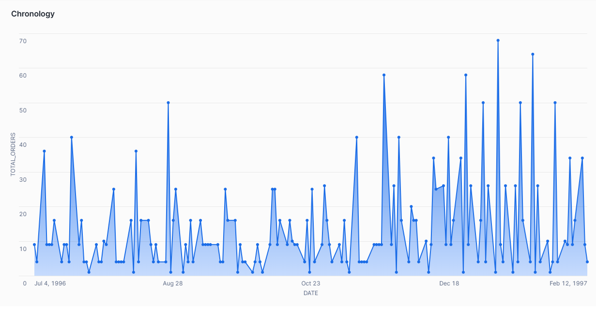

# **ETL proces datasetu NorthWind**
Účelom tohto úložiska je implementovať proces ETL v softvéri Snowflake, ktorý sa zameriava na analýzu údajov zo súboru údajov NorthWind. Súčasťou projektu je skúmanie, transformácia a načítanie údajov týkajúcich sa zákazníkov, dodávateľov, zamestnancov, lokalít a iných dôležitých osôb do viacrozmerného modelu typu hviezda. Dátový model pomáha pri rozhodovaní a poskytuje užitočné poznatky pre ďalšie spracovanie údajov. Poskytuje tiež efektívnu analýzu a vizualizáciu kľúčových ukazovateľov.

---
## **1. Úvod a popis zdrojových dát**
Cieľom projektu je implementovať procesy ETL v prostredí Snowflake na spracovanie a analýzu vybraných súborov údajov. Cieľom projektu je vytvoriť  multi-dimenzionálny model typu hviezda na vizualizáciu a analýzu dôležitých ukazovateľov. Hlavným cieľom je transformácia nespracovaných údajov z rôznych zdrojov do formátu vhodného na analýzu a prezentácia výsledkov s cieľom poskytnúť cenné analytické poznatky a podporu pri rozhodovaní. Odkaz na DB najdete [tu](https://github.com/microsoft/sql-server-samples/tree/master/samples/databases).

### **Zdrojove data:**
- `categories.csv`: Obsahuje informácie o kategóriách produktov.
- `customers.csv`: Údaje o zákazníkoch.
- `employees.csv`: Informácie o zamestnancoch.
- `orderdetails.csv`: Údaje o objednávke.
- `orders.csv`: Podrobnosti o objednávke.
- `products.csv`: Informácie o produkte.
- `shippers.csv`: Informácie o dopravcovi.
- `suppliers.csv`: Údaje o dodávateľovi.

Úlohou procesu ETL je pripraviť údaje, transformovať a sprístupniť ich na ďalšie vytváranie tabuliek demencie a tabulky faktov.

---
### **1.1 Dátová architektúra**

ERD diagram NorthWind:

|  |
|:-:|
|*Obrazok 1: Entitno-relacna schema MovieLens*|

## 2. **Dimenzionalny model**

Je uvedený model hviezdicovej schémy, v ktorej `fact_orders` je hlavnou tabuľkou faktov a sú zahrnuté ďalšie dimenzie:
- **`dim_locations`**: Obsahuje údaje o polohe (informácie o adrese, mestách, psč a krajinách).
- **`dim_customers`**:  Ukladá informácie o zákazníkovi (obsahuje ID zákazníka, meno a odkaz na miesto).
- **`dim_suppliers`**: Obsahuje informácie o predajcovi (ID predajcu, názov predajcu a odkaz na miesto).
- **`dim_employees`**: Uložené údaje o zamestnancoch (identifikátor zamestnanca a jeho celé meno).
- **`dim_date`**: Tabuľka časových údajov (dátumy a ich atribúty: rok, mesiac, deň a deň v týždni).
- **`dim_products`**: "Obsahuje informácie o produktoch (ID produktu, názov produktu, kategória, a ďalšie atribúty súvisiace s produktmi)."

Na správne mapovanie relácie N:M medzi objednávkami a produktmi sa použila prepojovacia tabuľka `bridge_orders_products`.

Štruktúra multi-dimenzionálneho modelu typu hviezda je znázornená nižšie

|  |
|:-:|
|*Obrazok 2: Star schema NorthWind*|

## **3. ETL proces v Snowflake**

ETL proces zahŕňal tri hlavné fázy: `extrakciu` (Extract), `transformáciu`(Transform) a `nahratie` (Load). Tento proces bol realizovaný v prostredí Snowflake s cieľom spracovať zdrojové dáta zo staging vrstvy a pripraviť ich na využitie vo viacdimenzionálnom modeli, ktorý je optimalizovaný pre analýzu a vizualizáciu.

---
### **3.1 Extract (Extrahovanie dát)**

Pomocou tohto príkazu vytvoríme novy `Stage` na dočasné uloženie údajov v systéme Snowflake a nahráme tam naše `.csv` súbory.

```sql
CREATE OR REPLACE STAGE igilchik_stage FILE_FORMAT = (TYPE = 'CSV' FIELD_OPTIONALLY_ENCLOSED_BY = '"');
```

Potom vytvoríme nové `Staging` tabuľky, po ktorých prenesieme údaje zo súborov `.csv` do novovytvorených tabuliek. Podobný príkaz bol použitý pre každú tabuľku:

1. **Vytvorenie**

```sql
CREATE OR REPLACE TABLE customers_staging (
    id INT,
    customername STRING,
    contactname STRING,
    address STRING,
    city STRING,
    postalCode STRING,
    country STRING
);
```

2. **Importovanie dat**

```sql
COPY INTO customers_staging
FROM @NORTHWIND_IGILCHIK.PUBLIC.IGILCHIK_STAGE/customers.csv
FILE_FORMAT = (TYPE = 'CSV' FIELD_OPTIONALLY_ENCLOSED_BY = '"' SKIP_HEADER = 1);
```

3. **Overenie spravnosti prikazu:**

```sql
SELECT * FROM customers_staging;
```

### 3.2 **Transformácia dát**

V tejto fáze sa údaje vyčistili, preložili a obohatili. Hlavným cieľom bolo vytvoriť tabuľky faktov a demencie na jednoduché a efektívne analýzy.

Vytvorenie dimenzii:

1. Tabuľka `dim_locations` bola vytvorená kombináciou údajov z tabuliek `suppliers_staging` a `customers_staging` s cieľom denormalizovať informácie o polohe. Tabuľka `dim_locations` obsahuje jedinečné záznamy o polohe vrátane adresy, mesta, PSČ a krajiny.<br>
**Typ dimenzie:: SCD1 (Slowly Changing Dimensions - Overwrite Old Value)**<br>
Adresy a ďalšie informácie možno aktualizovať bez zachovania historických údajov.

```sql
CREATE OR REPLACE TABLE dim_locations (
    location_id INT,
    address VARCHAR(100),
    city VARCHAR(50),
    postalcode VARCHAR(20),
    country VARCHAR(50)
);
```
```sql
INSERT INTO dim_locations (location_id, address, city, postalcode, country)
SELECT ROW_NUMBER() OVER (ORDER BY address) AS location_id,
       address, city, postalcode, country
FROM (
    SELECT DISTINCT address, city, postalcode, country FROM suppliers_staging
    UNION
    SELECT DISTINCT address, city, postalcode, country FROM customers_staging
) locations;
```

2. Tabuľka `dim_customers` bola vytvorená spojením tabuľky `customers_staging` s tabuľkou `dim_locations`, čím sa vytvorilo prepojenie medzi zákazníkmi a ich lokalitami. Tabuľka `dim_customers` obsahuje informácie o zákazníkoch, ako je meno a odkaz na lokalitu.<br>
**Typ dimenzie: SCD1 (Slowly Changing Dimensions - Overwrite Old Value)**<br>
Informácie o zákazníkovi sa aktualizujú bez uloženia histórie zmien.

```sql
CREATE OR REPLACE TABLE dim_customers (
    customer_id INT,
    name VARCHAR(100),
    location_id INT
);
```
```sql
INSERT INTO dim_customers (customer_id, name, location_id)
SELECT 
    c.id AS customer_id,
    c.customername AS name,
    l.location_id
FROM customers_staging c
JOIN dim_locations l
ON c.address = l.address 
   AND c.city = l.city
   AND c.postalCode = l.postalcode
   AND c.country = l.country;
```

3. Tabuľka `dim_supplier`s bola vytvorená podobne ako `tabuľka customers`. Kombinuje údaje z tabuľky `suppliers_staging` s tabuľkou `dim_locations` na prepojenie dodávateľov s ich lokalitami. Tabuľka dim_suppliers obsahuje názvy dodávateľov a prepojenia na ich umiestnenia.<br>
**Typ dimenzie: SCD1 (Slowly Changing Dimensions - Overwrite Old Value)**<br>
Údaje sa aktualizujú bez uloženia historických hodnôt.
```sql
CREATE OR REPLACE TABLE dim_suppliers (
    supplier_id INT,
    name VARCHAR(100),
    location_id INT
);
```
```sql
INSERT INTO dim_suppliers (supplier_id, name, location_id)
SELECT s.id AS supplier_id,
       s.suppliername AS name,
       l.location_id
FROM suppliers_staging s
JOIN dim_locations l
  ON s.address = l.address AND s.city = l.city
  AND s.postalcode = l.postalcode AND s.country = l.country;
```

4. Tabuľka `dim_employees` bola vytvorená pomocou údajov z tabuľky `employees_staging`. Združuje informácie o zamestnancoch vrátane ich mien vytvorených spojením mena a priezviska.<br>
**Typ dimenzie: SCD1 (Slowly Changing Dimensions - Overwrite Old Value)**<br>
Informácie o zamestnancoch sa aktualizujú bez uloženia historických údajov.
```sql
CREATE OR REPLACE TABLE dim_employees (
    employee_id INT,
    full_name VARCHAR(100)
);
```
```sql
INSERT INTO dim_employees (employee_id, full_name)
SELECT 
    e.EMPLOYEEID AS employee_id, 
    CONCAT(e.FIRSTNAME, ' ', e.LASTNAME) AS full_name
FROM employees_staging e;
```

5. Tabuľka `dim_date` bola vytvorená extrakciou jedinečných dátumov z tabuľky `orders_staging` a ich konverziou na samostatné zložky: rok, mesiac, deň a deň v týždni. Tabuľka sa používa na analýzu časových údajov.<br>
**Typ dimenzie: SCD0 (Slowly Changing Dimensions - Retain Original Value)**<br>
Údaje o dátume sa po vytvorení nezmenia.
```sql
CREATE OR REPLACE TABLE dim_date AS
SELECT
    ROW_NUMBER() OVER (ORDER BY TO_DATE(TO_TIMESTAMP(orderdate, 'YYYY-MM-DD HH24:MI:SS'))) AS date_id,
    DATE_PART('year', TO_TIMESTAMP(orderdate, 'YYYY-MM-DD HH24:MI:SS')) AS year,
    DATE_PART('month', TO_TIMESTAMP(orderdate, 'YYYY-MM-DD HH24:MI:SS')) AS month,
    DATE_PART('day', TO_TIMESTAMP(orderdate, 'YYYY-MM-DD HH24:MI:SS')) AS day,
    TO_DATE(TO_TIMESTAMP(orderdate, 'YYYY-MM-DD HH24:MI:SS')) AS full_date,
    CASE DATE_PART('dow', TO_TIMESTAMP(orderdate, 'YYYY-MM-DD HH24:MI:SS')) 
        WHEN 1 THEN 'Monday'
        WHEN 2 THEN 'Tuesday'
        WHEN 3 THEN 'Wednesday'
        WHEN 4 THEN 'Thursday'
        WHEN 5 THEN 'Friday'
        WHEN 6 THEN 'Saturday'
        WHEN 7 THEN 'Sunday'
    END AS dayOfWeekAsString
FROM orders_staging;
```

6. Tabuľka `dim_products` bola vytvorená extrakciou informácií o produktoch z tabuľky `products_staging` a obohatená o údaje z tabuľky `categories_staging`. Obsahuje atribúty, ktoré opisujú produkty, ich kategórie, jednotky a ďalšie charakteristiky. Tabuľka slúži na analýzu produktového portfólia a kategorizáciu predávaných položiek. <br>
**Typ dimenzie: SCD0 (Slowly Changing Dimensions - Retain Original Value)**
Údaje o produktoch sa po vytvorení nezmenia.
```sql
CREATE OR REPLACE TABLE dim_products (
    product_id INT,
    productname VARCHAR(255),
    category VARCHAR(255),
    description VARCHAR(255),
    unit VARCHAR(45)
);
```
```sql
INSERT INTO dim_products (product_id, productname, category, description, unit)
SELECT 
    p.ProductID,
    p.ProductName,
    c.CategoryName, 
    c.Description AS CategoryDescription, 
    p.Unit
FROM products_staging p
JOIN categories_staging c
ON p.CategoryID = c.CategoryID; 
```

Vytvorenie factovej tabulky:

- Tabuľka `fact_orders` bola vytvorená spojením viacerých tabuliek: `orders_staging`, `bridge_orders_products`, `orderdetails_staging`, `products_staging`, a `dim_date`. Obsahuje kľúčové ukazovatele, ako napríklad množstvo produktov, jednotkovú cenu, celkovú hodnotu objednávky, a odkazy na príslušné dimenzie.<br>
**Typ dimenzie: Faktová tabuľka pre OLAP analýzy (Online Analytical Processing).**
Tabuľka spája viacero dimenzií s cieľom umožniť komplexnú analýzu predajných údajov.
```sql
CREATE OR REPLACE TABLE fact_orders AS
SELECT
    o.id AS order_id,
    od.quantity AS quantity,
    CAST(p.price AS DECIMAL(10,2)) AS price, 
    (od.quantity * CAST(p.price AS DECIMAL(10,2))) AS total_price, 
    o.customerid AS customer_id,
    p.supplierid AS supplier_id,
    o.employeeid AS employee_id,
    d.date_id AS date_id
FROM orders_staging o
JOIN bridge_orders_products b ON o.id = b.orderid
JOIN dim_employees e ON o.employeeid = e.employee_id
JOIN dim_customers c ON o.customerid = c.customer_id
JOIN orderdetails_staging od ON o.id = od.orderid
JOIN products_staging p ON od.productid = p.ProductID
JOIN dim_date d ON DATE_PART('year', TO_TIMESTAMP(o.orderdate, 'YYYY-MM-DD HH24:MI:SS')) = d.year
                  AND DATE_PART('month', TO_TIMESTAMP(o.orderdate, 'YYYY-MM-DD HH24:MI:SS')) = d.month
                  AND DATE_PART('day', TO_TIMESTAMP(o.orderdate, 'YYYY-MM-DD HH24:MI:SS')) = d.day;
```

### **3.3 Nahrávanie dát**

Po transformaciach boli tabuľky dimenzie a faktov naplnené údajmi. Potom sa `staging` vymazali, aby sa optimalizoval priestor na ukladanie údajov.

```sql
DROP TABLE IF EXISTS PUBLIC.customers_staging;
DROP TABLE IF EXISTS PUBLIC.shippers_staging;
DROP TABLE IF EXISTS PUBLIC.employees_staging;
DROP TABLE IF EXISTS PUBLIC.orders_staging;
DROP TABLE IF EXISTS PUBLIC.orderdetails_staging;
DROP TABLE IF EXISTS PUBLIC.suppliers_staging;
DROP TABLE IF EXISTS PUBLIC.products_staging;
DROP TABLE IF EXISTS PUBLIC.categories_staging;
```

Výsledkom ETL procesu bolo efektívne a rýchle spracovanie údajov zo súborov .csv, ktoré umožnilo vytvoriť definovaný viacdimenzionálny model typu hviezda.

## **4 Vizualizácia dát**

Bolo vytvorených 6 vizualizácií, ktoré poskytujú komplexný prehľad o kľúčových metrikách a trendoch týkajúcich sa objednávok, zákazníkov, dodávateľov, zamestnancov, produktov a predaja.

|  |
|:-:|
|*Obrazok 3: Dashboard NorthWind datasetu*|

---
### **Graf 1. Chronology**

Tento graf znázorňuje `rastúci trend predaja` a  `celkových príjmov`  v časovom rámci od `novembra` **1996** do `februára` **1997**, ktorý koncom roka **1996** začal prudko rásť a `7. januára` **1997** dosiahol najvyšší výsledok predaja **(až 68 objednávok)**. Napriek tomu, že deň predtým, `6. januára` **1997**, bol zaznamenaný najnižší počet predajov **(1 objednavka)**, trend predaja pokračoval až do `10. februára` **1997**.<br>
**Tento prehľad je kľúčový pre analýzu sezónnych alebo špeciálnych predajných špičiek, ktoré môžu byť použité na optimalizáciu budúcich predajných stratégií.**

|  |
|:-:|
|*Obrazok 4: Chronology*|

```sql
SELECT 
    d.full_date,
    COUNT(f.order_id) AS total_orders
FROM fact_orders f
JOIN dim_date d ON f.date_id = d.date_id
GROUP BY d.full_date
ORDER BY d.full_date;
```

### **Graf 2. Comparing suppliers by order quantity**

Graf zobrazuje `porovnanie dodávateľov na základe počtu objednávok`. Z grafu je zrejmé, že medzi dodávateľmi sú značné rozdiely v počte objednávok. Napríklad dodávateľ `Plutzer Lebensmittelgroßmärkte AG` zaznamenal najväčší počet objednávok **(212)**, zatiaľ čo iní dodávatelia, ako napríklad `Escargots Nouveaux`, mal výrazne nižší počet objednávok **(11)**. <br>
**Tieto údaje môžu byť použité na optimalizáciu spolupráce s dodávateľmi alebo na identifikáciu tých, ktorí by mohli vyžadovať väčšiu pozornosť pri zvyšovaní objemu predaja.**

|  |
|:-:|
|*Obrazok 5: Comparing suppliers by order quantity*|

```sql
SELECT 
    s.name AS supplier_name, 
    COUNT(f.order_id) AS total_orders
FROM PUBLIC.fact_orders f
JOIN PUBLIC.dim_suppliers s ON f.supplier_id = s.supplier_id
GROUP BY s.name
ORDER BY total_orders DESC;
```

### **Graf 3. Average amount of employee orders**

Graf zobrazuje priemernú cenu objednávok `(AVG_ORDER_PRICE)`, ktoré spracovali jednotliví zamestnanci. Z grafu je viditeľné, že `Steven Buchanan` dosiahol najvyššiu priemernú cenu objednávok, a to **1195.9**, čím sa výrazne odlišuje od ostatných zamestnancov. Na druhej strane, `Michael Suyama` má najnižšiu priemernú hodnotu objednávok **523.1**, medzi analyzovanými zamestnancami. <br>
**Analyza môže pomôcť pri hodnotení ich výkonu a pri rozhodovaní o alokácii zdrojov na spracovanie objednávok.**

|  |
|:-:|
|*Obrazok 6: Average amount of employee orders*|

```sql
SELECT 
    e.full_name AS employee_name, 
    ROUND(AVG(f.total_price), 1) AS avg_order_price
FROM PUBLIC.fact_orders f
JOIN PUBLIC.dim_employees e ON f.employee_id = e.employee_id
GROUP BY e.full_name
ORDER BY avg_order_price DESC;
```

### **Graf 4. Cities most orders**

Tento graf zobrazuje `mestá s najvyšším počtom objednávok`. Tento graf ukazuje, že všetky mestá majú približne rovnaký počet objednávok, ale lídrom v počte objednávok je mesto `Graz` s celkovým počtom objednávok **183**. <br>
**Informácie môžu byť užitočné pre plánovanie logistických a marketingových aktivít v najviac aktívnych regiónoch.**

|  |
|:-:|
|*Obrazok 7: Cities most orders*|

```sql
SELECT 
    l.city,
    COUNT(f.order_id) AS total_orders
FROM PUBLIC.fact_orders f
JOIN PUBLIC.dim_customers c ON f.customer_id = c.customer_id
JOIN PUBLIC.dim_locations l ON c.location_id = l.location_id
GROUP BY l.city
ORDER BY total_orders DESC;
```
### **Graf 5. Total orders by month**

Tento graf ilustruje počet objednávok rozdelených podľa mesiacov. Najviac objednávok bolo v mesiaci `január` **(449)**, nasledujú `december` **(347)**, `november` **(280)**, `august` **(271)** a `october` **(249)**. Mesiace s najnižším počtom objednávok sú `september` **(138)** a `február` **(125)**.<br>
**Najvyššia aktivita je v zimných a jesenných mesiacoch, tato informacia môže byť užitočné pri plánovaní skladových zásob a marketingových kampaní.**

|  |
|:-:|
|*Obrazok 8: Total orders by month*|

```sql
SELECT 
    CASE d.month
        WHEN 1 THEN 'January'
        WHEN 2 THEN 'February'
        WHEN 3 THEN 'March'
        WHEN 4 THEN 'April'
        WHEN 5 THEN 'May'
        WHEN 6 THEN 'June'
        WHEN 7 THEN 'July'
        WHEN 8 THEN 'August'
        WHEN 9 THEN 'September'
        WHEN 10 THEN 'October'
        WHEN 11 THEN 'November'
        WHEN 12 THEN 'December'
    END AS order_month,
    COUNT(f.order_id) AS total_orders
FROM fact_orders f
JOIN dim_date d ON f.date_id = d.date_id
GROUP BY d.month
ORDER BY d.month;
```

### **Graf 6. Dependence of total revenue per orders by employees**

Tento graf zobrazuje vzťah medzi `celkovými príjmami` a `celkovými objednávkami` pre každého zamestnanca. Každý bod na grafe zodpovedá jednému zamestnancovi a ukazuje, ako počet objednávok **súvisí s celkovými príjmami**. Graf ukazuje závislosť medzi počtom objednávok a príjmami: zamestnanci s väčším počtom objednávok majú tendenciu vytvárať väčšie celkové príjmy. <br>
**Analýza môže pomôcť určiť efektívnosť zamestnancov a ich príspevok k celkovým príjmom spoločnosti.**

|  |
|:-:|
|*Obrazok 9: Dependence of total revenue per orders by employees*|

```sql
SELECT 
    COUNT(f.order_id) AS total_orders,
    SUM(f.total_price) AS total_revenue
FROM PUBLIC.fact_orders f
GROUP BY f.employee_id;
```

___
**Autor:** Tiutiun Daniil